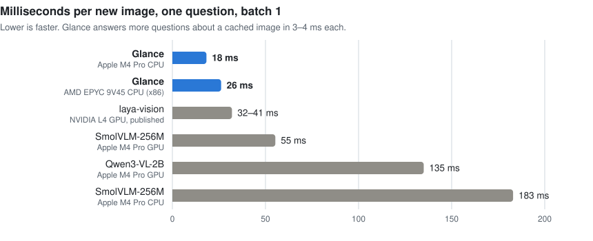
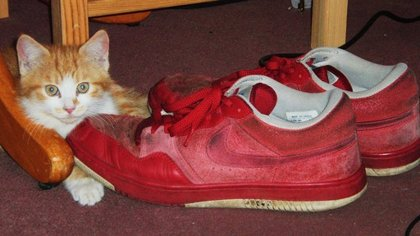

<div align="center">

# Glance

**Typed answers about images in milliseconds, on a CPU.**

Ask yes/no, multiple-choice or rating questions about an image and get a probability for every answer:
18 ms for a new image, 3 ms for each further question about it. No GPU.

[](LICENSE) [](paper/glance.pdf) [](weights/) [](pyproject.toml) [](#benchmarks)

[Quickstart](#quickstart) · [Examples](#examples) · [Benchmarks](#benchmarks) · [Weights](#weights) · [Model card](docs/model_card.md) · [Paper](paper/glance.pdf)

<picture>
  <source media="(prefers-color-scheme: dark)" srcset="docs/assets/latency-dark.svg">
  
</picture>

</div>

## Examples

Real outputs of the released model.

<table>
<tr>
<td align="center" width="50%"><br><b>A real photo</b></td>
<td align="center" width="50%"><br><b>An AI-generated image</b> with a malformed hand</td>
</tr>
</table>

| image | question | type | Glance's answer |
|---|---|---|---|
| real photo | Is there a cat in the image? | yes/no | **yes**, 0.999 |
| real photo | Which animal is in the picture? | choice | **cat** 0.70 · rabbit 0.29 · dog 0.01 |
| real photo | What color are the shoes? | choice | **red** 0.52 · black 0.26 · white 0.19 |
| real photo | Does this image contain visible generation errors? | yes/no | **no**, P(yes) 0.001 |
| AI image | Does this image contain visible generation errors? | yes/no | **yes**, 0.945 |
| AI image | Are any hands in this image malformed? | yes/no | **yes**, 0.892 |

<sub>Photo: <a href="https://www.flickr.com/photos/stevepj2009/5660823845/">steve p2008</a>, CC BY 2.0, via COCO. AI image: EvalMuse-40K, Stable Diffusion 2.1. Neither was used in training.</sub>

## Why Glance

- **Fast on a CPU.** 18.3 ms per new image on an Apple M4 Pro and 26.2 ms on an x86 server, then 3–4 ms per
  further question about the same image. Under 1 GB of memory, no GPU, ONNX Runtime included.
- **Probabilities, not text.** Every option gets a probability, so you can set your own threshold, rank
  images, or combine answers. Three question types cover most agent checks: yes/no, choice and score.
- **Many questions, one image.** The image is encoded once and cached; questions in one request are
  isolated from each other, so an answer never depends on which other questions you asked.
- **Open.** Apache-2.0 weights trained only on data whose licences allow commercial use, with an
  attribution record for every training image. The API follows the Jev / Laya decision format with an
  image added.

## Quickstart

Requires [uv](https://docs.astral.sh/uv/) and Python 3.12, on macOS or Linux.

```bash
git lfs install                                        # once: the weights are stored with Git LFS
git clone https://github.com/benalive/glance && cd glance
uv sync                                                # PyTorch, Transformers, ONNX Runtime
```

The clone includes the weights (1.6 GB). For the code and the released model only, clone with
`GIT_LFS_SKIP_SMUDGE=1` and then run `git lfs pull --include "weights/glance-c5-open-v4/*"` (1.05 GB).

```python
from glance.serve import Predictor

model = Predictor("weights/glance-c5-open-v4", device="cpu")     # ONNX Runtime on the CPU
out = model.predict({
    "cat":    {"type": "noul",   "instructions": "Is there a cat in the image?"},
    "animal": {"type": "choice", "instructions": "Which animal is in the picture?",
               "criteria": ["cat", "dog", "rabbit", "bird"]},
    "sharp":  {"type": "score",  "instructions": "How sharp is this photo?",
               "criteria": ["blurry", "soft", "ok", "sharp", "very sharp"]},
}, open("photo.jpg", "rb").read())

out["answers"]["cat"]["noul"]              # P(yes)
out["answers"]["animal"]["probabilities"]  # {"cat": 0.698, "dog": 0.010, "rabbit": 0.292, "bird": 0.000}
out["answers"]["sharp"]["score"]           # expected level, 0 = "blurry" ... 4 = "very sharp"
```

| type | you give | you get |
|---|---|---|
| `noul` (yes/no) | a question | P(yes) |
| `choice` | a question and 2–255 options | the most likely option and a probability for each |
| `score` | a question and ordered levels, lowest first | the expected level and a probability per level |

**As an HTTP server**, with a browser playground at the same address:

```bash
uv run python -m glance.serve --ckpt weights/glance-c5-open-v4      # http://127.0.0.1:8089

curl -s localhost:8089/v1/systemone -H 'Content-Type: application/json' -d '{
  "image": "'"$(base64 < photo.jpg | tr -d '\n')"'",
  "questions": {"cat": {"type": "noul", "instructions": "Is there a cat in the image?"}}}'
```

Tips: phrase error questions positively ("Does this image contain ...?"); resize large photos before
sending; the first request after start-up is slower while the model warms up.

## Benchmarks

**Speed.** Median per request, batch 1. Glance: the served code path on COCO photos, 4 CPU threads. Other
rows are reference points measured under their own conditions or published.

| model | hardware | new image | another question, same image |
|---|---|---|---|
| **Glance (this release)** | **Apple M4 Pro CPU** | **18.3 ms** | **3.0 ms** |
| **Glance (this release)** | **AMD EPYC 9V45 CPU (x86)** | **26.2 ms** | **4.1 ms** |
| laya-vision (published) | NVIDIA L4 GPU | 32–41 ms | – |
| SmolVLM-256M | Apple M4 Pro GPU / CPU | 55 / 183 ms | 13 / 23 ms |
| Qwen3-VL-2B | Apple M4 Pro GPU | 135 ms | 81 ms |
| Jev hosted API (community measurement) | network | ~300 ms per call | |

**Accuracy.** Held-out splits; each model scored as it would be used.

| task (metric) | Glance (134M) | Qwen3-VL-2B (2B) | SmolVLM-256M |
|---|---|---|---|
| Object presence, POPE random (accuracy) | **88.7%** | – | – |
| Object presence, POPE adversarial (accuracy) | 76.9% | 84.0% | 60.3% |
| Flawed AI images vs real photos, SalArt-VQA (AUROC) | **0.911** | 0.725 | – |
| Flawed vs clean AI images, ArtiBench (AUROC) | **0.667** | 0.409 | – |
| Malformed hands, HAD (AUROC) | **0.695** | 0.638 | – |
| Visible artifacts, RichHF-18K (AUROC) | **0.828** | 0.652 | – |
| Real photos wrongly flagged as flawed | **0.8%** | 14.8% | – |
| Real portraits flagged, worst demographic group (FairFace) | **0.5%** | – | – |

Glance is about 15 times smaller than Qwen3-VL-2B and runs on a CPU at a fraction of its latency.

**Good to know.** Open everyday questions are not its strength (60% on VQAv2 yes/no), and on AI-generated
images it mainly separates generated images from real photos; telling a subtle flaw from a clean image of
the same scene is much harder for it. English only; input is 256 px. Some training images come from
Playground v2.5, whose licence forbids using outputs to improve a text-to-image model, so do not use
Glance to train, reward or filter data for an image generator. The [model card](docs/model_card.md) has
the full picture.

## Weights

In [`weights/`](weights/), stored with Git LFS; check them with `shasum -a 256 -c SHA256SUMS` inside
that directory.

| path | what | size |
|---|---|---|
| `weights/glance-c5-open-v4/` | **the release model**: weights as safetensors and as ONNX, tokenizer, configs, calibration, model card, licence, attribution for every training image | 1.05 GB |
| `weights/checkpoints/C5_open4_s0.safetensors` | trained tensors of the released model, for use with the base models from the Hugging Face Hub | 79 MB |
| `weights/checkpoints/C5_open4_s1`, `_s2` | the other two seeds of the released recipe (paper §8) | 79 MB each |
| `weights/checkpoints/C5_general_v2_s0`–`s2` | stage-1 checkpoints of the recipe | 79 MB each |
| `weights/checkpoints/C5_open5_s0` | a retrain with procedural local anomalies (paper §7) | 79 MB |

The research models in the paper were trained on data that cannot be redistributed in weights (HAD,
RichHF-18K, KonIQ-10k, NonCommercial COCO photos) and are not released.

<details>
<summary><b>Reproducing the paper</b></summary>

Scripts run from the repository root. Datasets and base models are downloaded into the Hugging Face cache;
local data goes under `data/`, which is not in the repository. `results/` holds the summary tables the
paper's numbers come from, and the paper's appendix maps each table to its script. Per-item outputs are
not included; for the released model, regenerate them from the released weights with
`scripts/eval_checkpoint.py`.

| step | scripts (in `scripts/`) |
|---|---|
| licence-clean data | `fetch_clean.py`, `fetch_clean_artifacts.py`, `make_face_crops.py`, `build_clean_mix.py`, `build_clean_artifact_mix.py`, `check_clean_licences.py` |
| training (the released two-stage recipe) | `run_two_stage.sh`, `run_stage2.sh`, `run_v4.sh`, using `train_candidate.py` |
| evaluation | `eval_checkpoint.py`, `comparison_report.py`, `release_calibration.py`, `paired_bootstrap.py`, `recipe_table.py` |
| error-detection analyses | `salart_clean_ai.py`, `salart_breakdown.py`, `pair_probe.py`, `zoom_test.py`, `make_local_anomalies.py`, `anomaly_eval.py` |
| fairness and wording | `fairness_check.py`, `fairness_matched.py`, `wording_probe.py`, `fresh_wording_test.py` |
| release package and figures | `export_release.py`, `glance/onnx_export.py`, `make_readme_figures.py` |
| latency | `latency_sweep.py`, `latency_check.py`, `serving_footprint.py`, `bench/x86/` |

Training used an Apple M4 Pro GPU (MPS): about 27 and 31 minutes for the two stages. Optional extras:
`uv sync --extra mlx` (MLX ports, Apple silicon), `--extra export` (ONNX export), `--extra bench` (Laya
and laya-mlx for the Snake benchmark; the paper used laya 0.3.8, no longer on PyPI, so 0.3.9 is pinned).
Tests: `uv run pytest -q`.

</details>

## Citation

```bibtex
@techreport{shen2026glance,
  author      = {Shen, Yuan},
  title       = {Glance: Fast Typed Decisions about Images on a CPU},
  institution = {GitHub: benalive/glance},
  year        = {2026},
  type        = {Technical report},
  url         = {https://github.com/benalive/glance}
}
```
